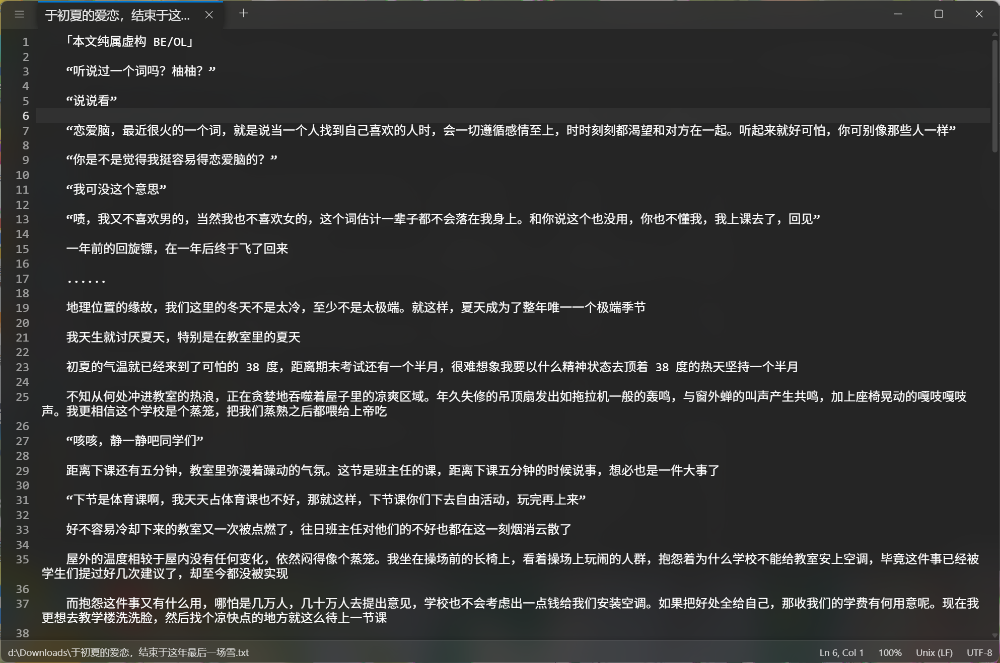
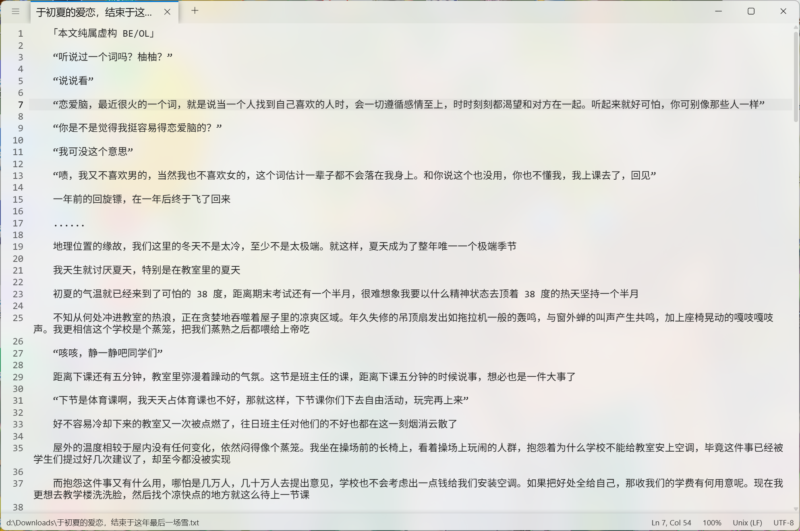

<p align="center">
  
</p>
<h1 align="center">
  NotepadE
</h1>
<p align="center">
  一个现代、轻量级、跨平台且极简设计的文本编辑器。
</p>
<p align="center">
  <a style="text-decoration:none" href="https://github.com/Hoshino-Yumetsuki/NotepadE/releases">
    
  </a>
  <a style="text-decoration:none">
    
  </a>
  <a style="text-decoration:none">
    
  </a>
</p>

[English](./README.md) | 简体中文




## 什么是 NotepadE？

[Notepads](https://github.com/0x7c13/Notepads) 是一款出色的现代记事本应用，但它是基于 UWP 的，仅在 Windows 上运行。NotepadE 是在 Web 技术和 Tauri 之上对 Notepads 的忠实 1:1 重写，因此相同的简洁外观和使用体验可以在任何平台上运行：Windows、macOS 和 Linux。

目标很简单：保留让 Notepads 使用起来愉快的一切——Fluent 风格、内建的标签页系统、极快的响应体验——同时使其跨平台并易于扩展。如果你喜欢 Notepads，但希望它能在你的 Mac 或 Linux 上运行，NotepadE 就是为你准备的。

- 使用 Fluent 风格并集成标签页系统。
- 轻量且启动迅速。
- 支持多标签编辑并可拖拽重排。
- 内置 Markdown 实时预览（并有丰富的插件集合）。
- 内置差异比较视图（并排预览你的更改）。
- 支持行号、高亮当前行和自动换行。
- 顶部右侧的搜索面板支持查找与替换功能。
- 提供浅色、深色和高对比度主题。

## 快捷键：

- `Ctrl+N` / `Ctrl+T`：新建标签页。
- `Ctrl+(Shift)+Tab`：在标签间切换。
- `Ctrl+Num(1-9)`：快速切换到指定标签。
- `Ctrl+"+"` / `Ctrl+"-"`：缩放文本；`Ctrl+0` 恢复默认缩放。
- `Ctrl+L` / `Ctrl+R`：切换文本书写方向（LTR/RTL）。
- `Ctrl+D`：复制当前行或所选内容。
- `Ctrl+J`：合并所选的多行。
- `Ctrl+E`：在 Web 上搜索所选内容。
- `Alt+Z`：切换自动换行。
- `Alt+Up` / `Alt+Down`：上移 / 下移当前行。
- `F5`：插入当前日期和时间。
- `Alt+P`：切换 Markdown 预览分屏视图。
- `Alt+D`：切换并排差异比较视图。

## Markdown 预览：

在 `.md` 文件中按 `Alt+P` 可以打开 Markdown 预览。预览由 [markdown-it](https://github.com/markdown-it/markdown-it) 提供，并使用来自 [mdit-plugins](https://mdit-plugins.github.io/) 的精选插件，渲染效果如下所示：

- 任务列表、脚注、定义列表以及提示/警告块（admonition）。
- 下标、上标、`==高亮==`、`++插入++` 与剧透块。
- 缩写、表情短码、带标题的图像以及自定义容器。
- 支持原生 HTML 渲染，渲染前会使用 [DOMPurify](https://github.com/cure53/DOMPurify) 进行清理。
- 远程图片仅在 URL 与内容类型通过安全检查后才会被请求。

预览与编辑器保持滚动同步，渲染输出始终与正在编辑的文本对应。

## 从源码构建：

NotepadE 使用 Tauri、React、Fluent UI v9、TypeScript、CodeMirror 6 和 Vite 构建。你需要 Node.js 20+、[Yarn](https://yarnpkg.com/) 4 以及 [Rust 工具链](https://rustup.rs/)。

```bash
# 安装依赖
yarn install

# 在开发模式下运行应用
yarn tauri dev

# 类型检查、代码风格校验和测试
yarn typecheck
yarn lint
yarn test

# 为当前平台构建发行包
yarn tauri build
```

## 平台说明：

- NotepadE 可通过 Tauri 在 Windows、macOS 和 Linux 上运行。
- 某些与平台相关的功能（如跳转菜单、文件关联）取决于宿主操作系统及打包后的构建。
- 非常大的文件可能影响响应速度；编辑器针对日常笔记与配置文件编辑进行了优化。

## 更新日志：

- [NotepadE Releases](https://github.com/Hoshino-Yumetsuki/NotepadE/releases)

## 隐私声明：

为保证完全透明：

- NotepadE 不会且永远不会收集你的个人信息。
- 不会追踪你的 IP。
- 不会记录你的键入内容，也不会读取你的任何文件，包括文件名与路径。
- 不会将任何键入内容或文件发送给作者或第三方。

NotepadE 是完全开源的。欢迎查看源码或自行构建。

## 致谢：

- [0x7c13/Notepads](https://github.com/0x7c13/Notepads) — 原始的 UWP 应用，是本项目 UI 设计与交互的灵感来源。

## 依赖与参考：

- [Tauri](https://tauri.app/)
- [React](https://react.dev/)
- [Fluent UI](https://github.com/microsoft/fluentui)
- [CodeMirror 6](https://codemirror.net/)
- [markdown-it](https://github.com/markdown-it/markdown-it)
- [mdit-plugins](https://github.com/mdit-plugins/mdit-plugins)
- [DOMPurify](https://github.com/cure53/DOMPurify)
- [Vite](https://vite.dev/)
